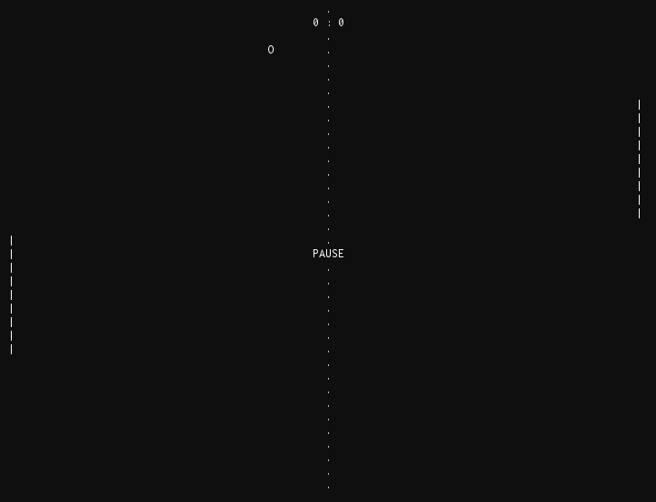

# tbpong
A small Pong game written in python using [termbox](https://github.com/nsf/termbox)

## Instructions

- To move the paddle on the left simply use the up and down arrow keys.
- Start the game by pressing the space bar
- Use CTRL-C, ESC, or the Q key to quit the game

-
This is work-in-progress, the AI still needs some improvements :)

